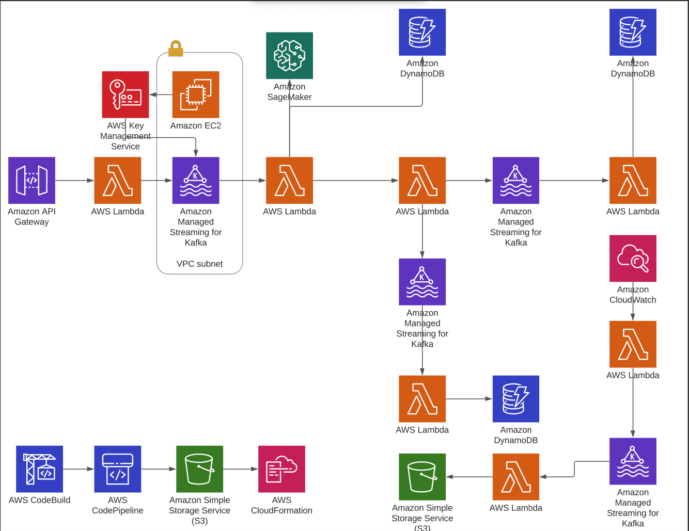

# cc-final-project-part3
**Teammates:** [Ahmed Shoukr](#https://github.com/ashoukr) and [Caroline Barker](#https://github.com/CarolineNB)

This project implements real time detection and classification of fraudulent credit card transactions using serverless architecture hosted in AWS. 


## Table of Contents
1. [Architecture Overview](#architecture-overview)
    - [Architecture Diagram](#architecture-diagram)
2. [Data](#data)
3. [Indvidual Components](#individual-components)
    - [MSK](#MSK)
    - [VPC, Subnets, Security Groups](#VPC-Subnets-Security-Groups)
    - [SAM CLI](#SAM-CLI)
    - [Machine Learning Classifier](#Machine-Learning-Classifier)
    - [API Gateway](#api-gateway)
    - [Lambda functions](#Lambda-functions)
    - [DynamoDB](#dynamodb)
    - [S3](#s3)


## Architecture Overview

### Architecture Diagram


* This is an initial design of the architecture for Kafka Streaming Data

* Note: Topic 3 Producer will run at time intervals to produce aggregate reports for each person

* Note: for each lambda, need to write exact MSK trigger as IAC


## Data 
dataset: https://www.kaggle.com/kartik2112/fraud-detection

We used a dataset of 150 users and their credit-card transaction history. Each object in the dataset represents a single transaction made by that user as well as includes an `is_fraud` value for classification training that we later utilized for our machine learning model fraud prediction classification. 


The following is an example of a data object within the dataset:
```
 {
   "uuid": "49b0020e-7842-4ed9-aa60-073f3f4864a2",
   "trans_date_trans_time": "6/28/2020 10:42",
   "cc_num": 6595970000000000,
   "merchant": "fraud_Wolf Inc",
   "category": "grocery_pos",
   "amt": 103.91,
   "street": "72030 Shelton Crossing Apt. 742",
   "city": "Stirling",
   "state": "NJ",
   "zip": 7980,
   "lat": 40.6774,
   "long": -74.4968,
   "job": "Science writer",
   "merch_lat": 39.921213,
   "merch_long": -74.817594,
   "is_fraud": 0,
   "First Name": "Jaylynn",
   "Last Name": "Golden"   
 }
```

## Individual Components


## MSK

We describe how we set up the MSK cluster in the `msk-setup.txt` file. In addition, we wrote the cluster as IAC using `clusterinfo2.json`. This can allow us to set up the cluster multiple times as needed.

### VPC, Subnets, Security Groups
We set up a VPC with 4 subnets for the MSK cluster for high availability. We created 2 private subnets (required by the brokers) and 2 public subnets (for the producer lambda functions). Note: the consumer lambda functions are not required to be in the same VPC or subnets in order to receive messages. 

## SAM CLI

We used the SAM CLI (pypi package) to deploy all of our infrasturcutre through code which made it very easy for us to make sure everything is written with good design and that we can have all of our policies in one place for example. Thereby, minimizing use of the AWS console.


## Machine Learning Classifier

Here we built and deployed our Machine Learning Classifier using AWS Sagemaker as shown in the architecture above. 


Once the data was preprocessed, we trained and deployed a baseline classifier as an additional layer for our fraud detection. Note, we did not use this algorithm as the primary classifier, but instead as a second layer if the business logic we deployed in the frontend did not mark a transaction as fraudulent. 

We retrieved a container image of `xgboost` model here:
```
container = get_image_uri(session.boto_region_name, 'xgboost', repo_version='1.2-1')
role = get_execution_role()
```

Then we created an estimator used to train on and save all the model artifacts.
```
xgb = sagemaker.estimator.Estimator(container, role, train_instance_count=1,
                                   train_instance_type='ml.m4.xlarge',
                                   output_path='s3://{}/{}/output'.format(session.default_bucket(), prefix),
                                   sagemaker_session = session)
```

In addition, we set the hyperparameters for the model using the `estimator.set_hyperparameters` api.

Here, we could have gone a step further and tried to tune the hyperparameters by inputting ranges instead of hard values. This would have allowed us to use cross-validation with the validation set in order to improve the model.

Finally, we deployed the model to a managed API endpoint using the following `estimator.deploy` command:
```
xgb_predictor = xgb.deploy(initial_instance_count=1, instance_type='ml.t2.medium')
```

Here we deployed using a smaller `ml.t2.medium` instance since we are only using this for the project.

Note, we primarily focused on ensuring we can solve the issue of class imbalance which was very apparent in the dataset we used. We discuss the methods we used in the data preprocessing section.


## Lambda functions
### Lambda Producer T1 : 
This lambda is triggered by an API post endpoint that holds a transaction object. Using KafkaProducer, we encode the transaction object and send the encoded message to topic 1 `approved`. 

### Lambda Consumer T1:
The transaction object is sent through the MSK and triggers the Lambda consumer that reads the object and decides if the the transaction should be approved or denied. There are two layers to this decision. The first being the history of the user's transaction which is in the form of an average of previus purchases. If the current transaction is greater that 25% of the average history of purchases it is denied on the spot. If it is under 25% it is then sent to the Machine Learning classification layer for another decision. The resulting decision is sent as an event to trigger Lambda Producer T2

### Lambda Producer T2 and T3:
Triggered by Lambda Consumer T2, this lambda messages either topic `approved` or `not_approved` depending on the result of the Consumer T1 decision. It then produces the message to the respective decision topic in the MSK to trigger the next lambda functions

### Lambda Consumer T2:
If the topic is `approved` it triggers this lambda to send and log the approved transactions in the dynamo db table `approved-transactions` with user's uuid's as well as the time/day of purchase

### Lambda Consumer T3:
If the topic is `not_approved` it triggers this lambda to send and log the denied transactions in the dynamo db table `rejected-transactions`


### Lambda Producer T4:
This producer publishes a stream of uuid's every hour to the KMS Stream to the topic `generate_reports`. This is so that we can update the transaction details to trigger Lambda Consumer T4 to write the "monthly" transaction logs for the consumer view.  

### Lambda Consumer T4:
Triggered by the KMS stream topic `generate_reports`, this lambda publishes the results of the transaction reports to the S3 bucket for the creation of the "monthly" transaction logs.

## Dynamo DB
We utilized 3 tables: rejected-transactions, daily-logs, user-history. 
* rejected-transactions: stores all the transactions that were denied by the classification layers 
* daily-logs: stores all records of approved transactions
* user-history: keeps record of the average spending rate of users


## S3 bucket
We used s3 for multiple use cases. We used it to store logs and cloudformation templates.

Specifically for the logs, we stored the monthly transaction logs that were generated by the `generate_reports` topic consumer.