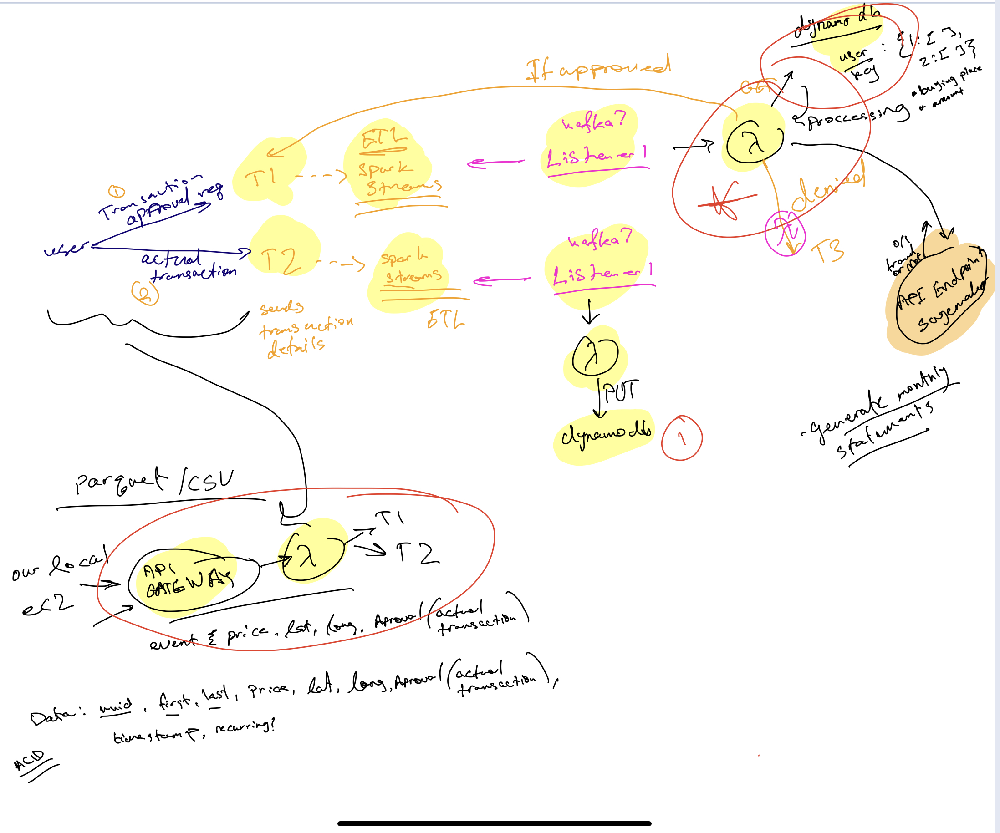

# cc-final-project-part3

## Architecure Overview

* This is an initial design of the architecture for Kafka Streaming Data

* Note: Topic 3 Producer will run at time intervals to produce aggregate reports for each person

* Note: for each lambda, need to write exact MSK trigger as IAC

## Individual Components

## MSK

We describe how we set up the MSK cluster in the `msk-setup.txt` file. In addition, we wrote the cluster as IAC using `clusterinfo2.json`. This can allow us to set up the cluster multiple times as needed.

### VPC, Subnets, Security Groups
We set up the V

## SAM CLI

We used the SAM CLI (pypi package) to deploy all of our infrasturcutre through code which made it very easy for us to make sure everything is written with good design and that we can have all of our policies in one place for example. Thereby, minimizing use of the AWS console.

## Machine Learning Classifier 

## Lambda functions
### Lambda Producer T1 : 
This lambda is triggered by an API post endpoint that holds a transaction object. Using KafkaProducer, we encode the transaction object and send the encoded message to topic 1 `approval`. 

### Lambda Consumer T1:
The transaction object is sent through the MSK and triggers the Lambda consumer that reads the object and decides if the the transaction should be approved or denied. There are two layers to this decision. The first being the history of the user's transaction which is in the form of an average of previus purchases. If the current transaction is greater that 25% of the average history of purchases it is denied on the spot. If it is under 25% it is then sent to the Machine Learning classification layer for another decision. The resulting decision is sent as an event to trigger Lambda Producer T2

### Lambda Producer T2:
Triggered by Lambda Consumer T2, this lambda messages either topic `approved` or `not_approved` depending on the result of the Consumer T1 decision. It then produces the message to the respective decision topic in the MSK to trigger the next lambda functions

### Lambda Consumer T2:
If the topic is `approved` it triggers this lambda do 

## Dynamo DB

## Additional Lambda Layer

## DynamoDB